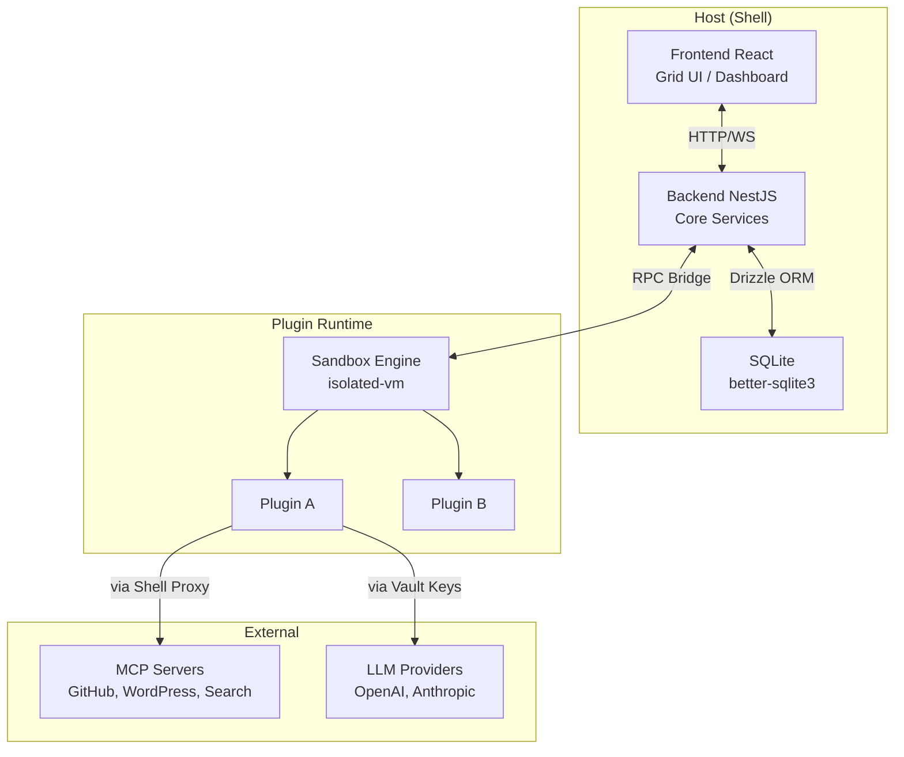
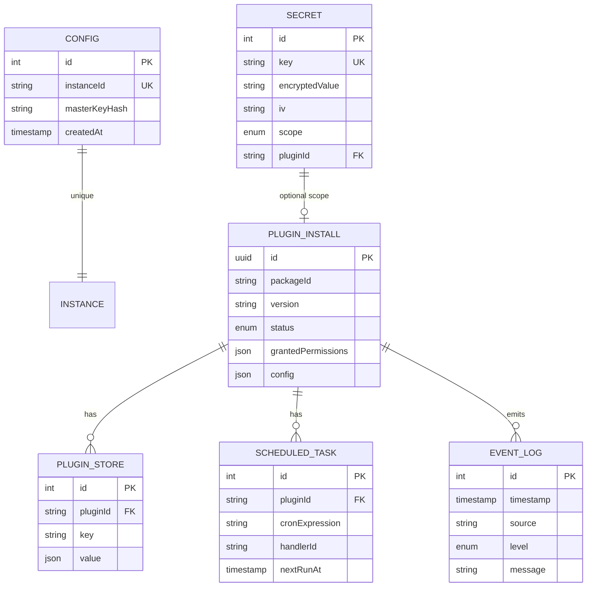
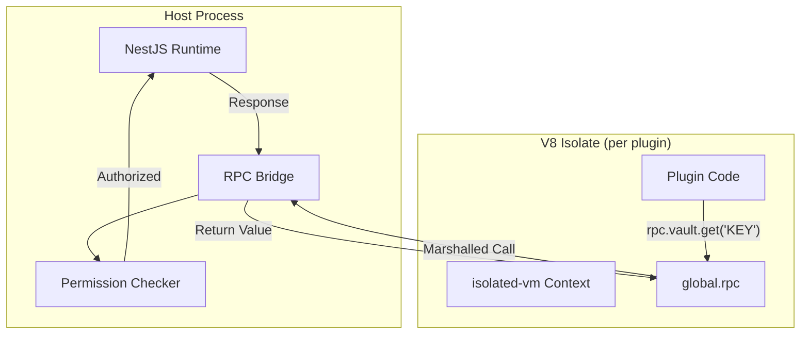
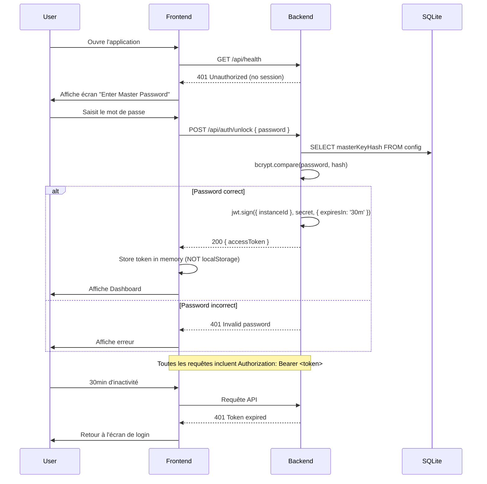
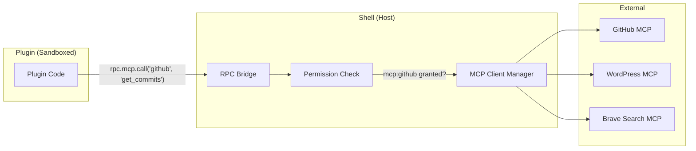
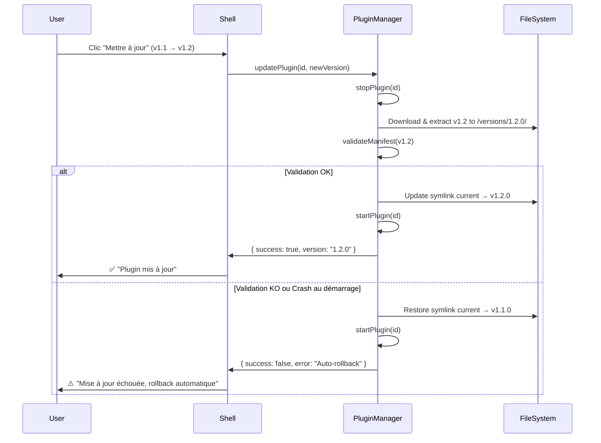
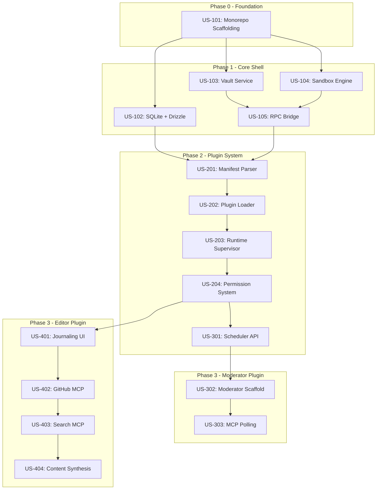
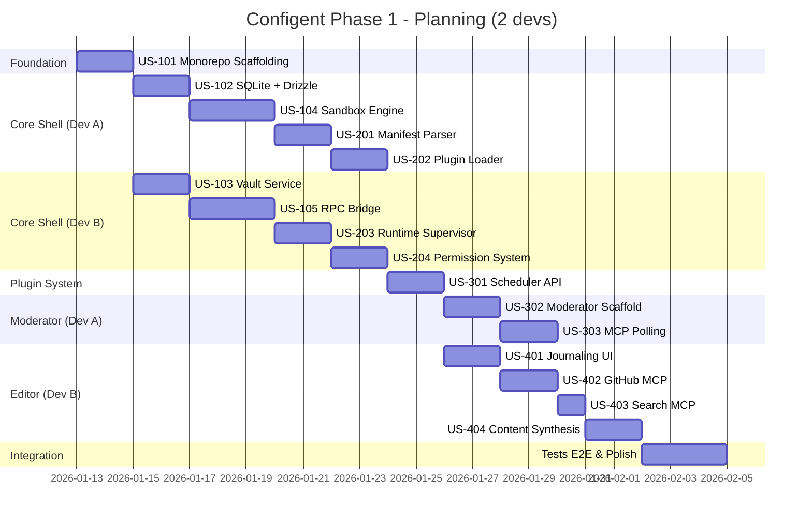

# Architecture Technique : Configent

**Version :** 1.0.0  
**Statut :** Draft - En attente de validation  
**Date :** Janvier 2026  
**Auteur :** Architecte Technique

---

## Table des Matières

1. [Vue d'Ensemble](#1-vue-densemble)
2. [Architecture Monorepo](#2-architecture-monorepo)
3. [Backend : Architecture Hexagonale (NestJS)](#3-backend--architecture-hexagonale-nestjs)
4. [Frontend : Clean Architecture (React + Vite)](#4-frontend--clean-architecture-react--vite)
5. [Plugin SDK](#5-plugin-sdk)
6. [Modèle de Données](#6-modèle-de-données)
7. [Sécurité & Isolation](#7-sécurité--isolation)
8. [Contrats d'API](#8-contrats-dapi)
9. [Plugins de Référence](#9-plugins-de-référence)
10. [Points de Vigilance & Incohérences](#10-points-de-vigilance--incohérences)

---

## 1. Vue d'Ensemble

### 1.1 Architecture Globale

Configent adopte une architecture **Micro-Kernel (Host/Plugin)** où le Shell (Host) gère le cycle de vie, la sécurité et l'interface utilisateur, tandis que les fonctionnalités métiers sont exclusivement portées par des Plugins.



### 1.2 Principes Directeurs

| Principe                      | Application                                               |
| ----------------------------- | --------------------------------------------------------- |
| **Local-First**               | SQLite embarqué, pas de dépendance Docker/PostgreSQL      |
| **Hexagonal (Backend)**       | Domain pur (POJO), ports/adapters, injection via Tokens   |
| **Feature-Sliced (Frontend)** | Composants Smart/Dumb, Services isolés par feature        |
| **Zero Trust Plugins**        | Exécution sandboxée, permissions explicites, RPC contrôlé |
| **SOLID**                     | Single Responsibility, Interface Segregation partout      |

---

## 2. Architecture Monorepo

### 2.1 Structure Racine

```
configent/
├── apps/
│   ├── host-backend/        # NestJS - Core Shell Backend
│   └── host-frontend/       # React + Vite - Dashboard UI
├── packages/
│   ├── sdk/                 # SDK partagé (Types, Utils)
│   ├── sandbox/             # isolated-vm wrapper
│   └── plugin-types/        # Définitions TypeScript pour les plugins
├── plugins/                 # Plugins de référence
│   ├── moderator/
│   └── editor/
├── drizzle/                 # Migrations Drizzle
├── pnpm-workspace.yaml
├── turbo.json               # Turborepo config (optionnel)
└── package.json
```

### 2.2 Configuration Workspace

```yaml
# pnpm-workspace.yaml
packages:
  - "apps/*"
  - "packages/*"
  - "plugins/*"
```

### 2.3 Dépendances Clés

| Package      | Version | Justification                   |
| ------------ | ------- | ------------------------------- |
| `pnpm`       | ^9.x    | Workspace natif, performance    |
| `typescript` | ^5.7    | Strict mode obligatoire         |
| `turbo`      | ^2.x    | Build orchestration (optionnel) |

---

## 3. Backend : Architecture Hexagonale (NestJS)

### 3.1 Règles Fondamentales

> [!CAUTION]
> **Pureté du Domaine (CRITIQUE)** : Les entités dans `domain/` doivent être des **POJOs purs**. Aucune annotation (`@Entity()`, `@Column()`) n'est autorisée. La configuration de persistance se fait uniquement via Drizzle schemas dans `infrastructure/`.

> [!IMPORTANT]
> **Pattern Use Case** : Pour la logique applicative, privilégier strictement le pattern **Use Case** (une classe par action métier, ex: `CreateSecretUseCase`) plutôt que des "Services" génériques (`VaultService`). Cela favorise SRP (Single Responsibility Principle) et la testabilité.

### 3.2 Structure par Module

```
apps/host-backend/src/
├── main.ts
├── app.module.ts
├── modules/
│   ├── vault/                       # Module : Gestion des Secrets
│   │   ├── domain/
│   │   │   ├── entities/
│   │   │   │   └── secret.entity.ts          # POJO pur
│   │   │   ├── ports/
│   │   │   │   ├── secret.repository.port.ts # Interface
│   │   │   │   └── index.ts                  # Export + Token
│   │   │   └── exceptions/
│   │   │       └── secret-not-found.exception.ts
│   │   ├── application/
│   │   │   ├── use-cases/
│   │   │   │   ├── encrypt-secret.use-case.ts
│   │   │   │   ├── decrypt-secret.use-case.ts
│   │   │   │   └── get-secret.use-case.ts
│   │   │   ├── dtos/
│   │   │   │   ├── create-secret.dto.ts
│   │   │   │   └── secret-response.dto.ts
│   │   │   └── handlers/                     # CQRS optionnel
│   │   └── infrastructure/
│   │       ├── persistence/
│   │       │   ├── drizzle/
│   │       │   │   └── secret.schema.ts      # Drizzle schema
│   │       │   └── secret.repository.ts      # Implémentation
│   │       ├── web/
│   │       │   └── vault.controller.ts       # API REST
│   │       └── adapters/
│   │           └── crypto.adapter.ts         # AES-256-GCM
│   │   └── vault.module.ts
│   │
│   ├── plugins/                     # Module : Gestion des Plugins
│   ├── sandbox/                     # Module : Isolation Engine
│   ├── scheduler/                   # Module : Tâches Cron
│   ├── rpc-bridge/                  # Module : Communication Shell <-> Plugin
│   └── config/                      # Module : Configuration Instance
│
├── shared/
│   ├── database/
│   │   ├── drizzle.config.ts
│   │   └── database.module.ts
│   └── guards/
│       └── master-password.guard.ts
```

### 3.3 Injection de Dépendances (Tokens)

```typescript
// domain/ports/index.ts
export const I_SECRET_REPOSITORY = Symbol("ISecretRepository");

export interface ISecretRepository {
  findByKey(key: string): Promise<SecretEntity | null>;
  save(secret: SecretEntity): Promise<void>;
  deleteByKey(key: string): Promise<void>;
}
```

```typescript
// vault.module.ts
import { Module } from "@nestjs/common";
import { I_SECRET_REPOSITORY } from "./domain/ports";
import { DrizzleSecretRepository } from "./infrastructure/persistence/secret.repository";
import { VaultController } from "./infrastructure/web/vault.controller";
import { EncryptSecretUseCase } from "./application/use-cases/encrypt-secret.use-case";

@Module({
  controllers: [VaultController],
  providers: [
    EncryptSecretUseCase,
    {
      provide: I_SECRET_REPOSITORY,
      useClass: DrizzleSecretRepository,
    },
  ],
  exports: [I_SECRET_REPOSITORY],
})
export class VaultModule {}
```

### 3.4 Modules Backend (Vue d'ensemble)

| Module        | Responsabilité                       | User Stories           |
| ------------- | ------------------------------------ | ---------------------- |
| `auth`        | Master Password, JWT Session         | -                      |
| `config`      | Singleton instance, Master Password  | US-102                 |
| `vault`       | Encryption/Decryption AES-256-GCM    | US-103                 |
| `sandbox`     | isolated-vm, Resource limits         | US-104, US-105         |
| `plugins`     | Manifest parsing, Loader, Supervisor | US-201, US-202, US-203 |
| `permissions` | Grant/Deny, Injection conditionnelle | US-204                 |
| `scheduler`   | Cron registration, Job queue         | US-301                 |
| `rpc-bridge`  | Marshalling, Permission check        | US-105                 |
| `mcp-client`  | MCP protocol proxy                   | US-303, US-402, US-403 |
| `store`       | Key-Value plugin storage             | US-401                 |

---

## 4. Frontend : Clean Architecture (React + Vite)

### 4.1 Structure des Dossiers

```
apps/host-frontend/src/
├── main.tsx
├── App.tsx
├── app/                    # Routes (React Router ou pages simples)
│   ├── dashboard/
│   │   └── DashboardPage.tsx
│   ├── vault/
│   │   └── VaultPage.tsx
│   └── settings/
│       └── SettingsPage.tsx
│
├── components/             # Composants UI Réutilisables (Dumb)
│   ├── ui/                 # Design System (Shadcn/UI customisé)
│   │   ├── Button.tsx
│   │   ├── Card.tsx
│   │   ├── Dialog.tsx
│   │   ├── Input.tsx
│   │   └── Toast.tsx
│   └── shared/             # Composants complexes partagés
│       ├── Navbar.tsx
│       ├── Sidebar.tsx
│       └── PluginTileFrame.tsx   # Iframe sandboxée
│
├── features/               # Modules Métiers (Smart)
│   ├── auth/
│   │   ├── components/
│   │   │   └── MasterPasswordForm.tsx
│   │   ├── hooks/
│   │   │   └── useUnlock.ts
│   │   ├── services/
│   │   │   └── auth.service.ts
│   │   └── types/
│   │       └── auth.types.ts
│   │
│   ├── vault/
│   │   ├── components/
│   │   │   ├── SecretList.tsx
│   │   │   └── SecretForm.tsx
│   │   ├── hooks/
│   │   │   └── useSecrets.ts
│   │   └── services/
│   │       └── vault.service.ts
│   │
│   ├── plugins/
│   │   ├── components/
│   │   │   ├── PluginCard.tsx
│   │   │   ├── PluginGrid.tsx      # Bento Layout
│   │   │   └── PermissionModal.tsx
│   │   ├── hooks/
│   │   │   ├── usePlugins.ts
│   │   │   └── usePluginComms.ts   # postMessage handler
│   │   └── services/
│   │       └── plugins.service.ts
│   │
│   └── logs/
│       ├── components/
│       │   └── LogViewer.tsx
│       └── hooks/
│           └── useLogs.ts
│
├── lib/                    # Configuration globale
│   ├── api-client.ts       # Axios instance configurée
│   ├── query-client.ts     # TanStack Query config
│   └── utils.ts
│
├── stores/                 # État global (Zustand si nécessaire)
│   └── app.store.ts
│
└── types/                  # Types TS partagés
    ├── api.types.ts
    └── plugin.types.ts
```

### 4.2 Règles de Conception

#### Smart vs Dumb Components

```typescript
// ❌ INTERDIT - Logique dans un composant UI
// components/ui/Button.tsx
export const Button = () => {
  const [data, setData] = useState();
  useEffect(() => {
    fetch("/api/...");
  }, []); // INTERDIT
};

// ✅ CORRECT - Composant UI pur
// components/ui/Button.tsx
interface ButtonProps {
  onClick: () => void;
  children: React.ReactNode;
  variant?: "primary" | "secondary";
  isLoading?: boolean;
}
export const Button: React.FC<ButtonProps> = ({
  onClick,
  children,
  variant,
  isLoading,
}) => (
  <button
    className={cn(buttonVariants({ variant }))}
    onClick={onClick}
    disabled={isLoading}
  >
    {isLoading ? <Spinner /> : children}
  </button>
);
```

#### Services API

```typescript
// features/vault/services/vault.service.ts
import { apiClient } from "@/lib/api-client";
import type { Secret, CreateSecretDto } from "../types/vault.types";

export const vaultService = {
  async getSecrets(): Promise<Secret[]> {
    const response = await apiClient.get<Secret[]>("/vault/secrets");
    return response.data;
  },

  async createSecret(dto: CreateSecretDto): Promise<Secret> {
    const response = await apiClient.post<Secret>("/vault/secrets", dto);
    return response.data;
  },

  async deleteSecret(key: string): Promise<void> {
    await apiClient.delete(`/vault/secrets/${key}`);
  },
};
```

#### Custom Hooks

```typescript
// features/vault/hooks/useSecrets.ts
import { useQuery, useMutation, useQueryClient } from "@tanstack/react-query";
import { vaultService } from "../services/vault.service";

export const useSecrets = () => {
  const queryClient = useQueryClient();

  const secretsQuery = useQuery({
    queryKey: ["secrets"],
    queryFn: vaultService.getSecrets,
  });

  const createMutation = useMutation({
    mutationFn: vaultService.createSecret,
    onSuccess: () => {
      queryClient.invalidateQueries({ queryKey: ["secrets"] });
    },
  });

  return {
    secrets: secretsQuery.data ?? [],
    isLoading: secretsQuery.isLoading,
    createSecret: createMutation.mutate,
    isCreating: createMutation.isPending,
  };
};
```

### 4.3 Communication Plugin Iframe

```typescript
// features/plugins/hooks/usePluginComms.ts
import { useEffect, useCallback } from "react";

interface PluginMessage {
  type: "RPC_REQUEST";
  id: string;
  method: string;
  params: unknown[];
}

export const usePluginComms = (pluginId: string, iframeRef: React.RefObject<HTMLIFrameElement>) => {
  const handleMessage = useCallback(
    (event: MessageEvent<PluginMessage>) => {
      // Validate origin matches plugin's expected origin
      if (event.data.type !== "RPC_REQUEST") return;

      // Forward to backend RPC bridge
      // Respond via postMessage
    },
    [pluginId]
  );

  useEffect(() => {
    window.addEventListener("message", handleMessage);
    return () => window.removeEventListener("message", handleMessage);
  }, [handleMessage]);
};
```

---

## 5. Plugin SDK

### 5.1 Structure du Package SDK

```
packages/sdk/
├── src/
│   ├── index.ts
│   ├── types/
│   │   ├── manifest.types.ts      # ManifestSchema
│   │   ├── rpc.types.ts           # RPC method signatures
│   │   ├── permissions.types.ts   # Permission scopes
│   │   └── tile.types.ts          # Bento UI schema
│   ├── validation/
│   │   └── manifest.validator.ts  # Zod schema
│   └── client/
│       └── plugin-client.ts       # Client-side RPC wrapper
├── package.json
└── tsconfig.json
```

### 5.2 Manifest Schema (Zod)

```typescript
// packages/sdk/src/validation/manifest.validator.ts
import { z } from "zod";

export const PermissionScope = z.enum([
  "vault:read",
  "network:public",
  "storage:read",
  "storage:write",
  "ui:notify",
  "schedule:register",
  "mcp:call",
]);

export const TileSchema = z.object({
  id: z.string(),
  type: z.enum(["webview"]),
  size: z.enum(["1x1", "1x2", "2x1", "2x2"]),
  src: z.string(),
});

export const ManifestSchema = z.object({
  id: z.string().regex(/^[a-z]+\.[a-z]+\.[a-z]+$/), // reverse-domain
  name: z.string().min(1).max(50),
  version: z.string().regex(/^\d+\.\d+\.\d+$/), // SemVer
  description: z.string().optional(),
  permissions: z.array(PermissionScope),
  entrypoint: z.string().default("index.js"),
  tiles: z.array(TileSchema).optional(),
});

export type Manifest = z.infer<typeof ManifestSchema>;
export type Permission = z.infer<typeof PermissionScope>;
```

### 5.3 Plugin Types

```typescript
// packages/plugin-types/src/index.ts

// RPC Interface exposée aux plugins
export interface IPluginRPC {
  vault: {
    getSecret(key: string): Promise<string>;
  };
  network: {
    fetch(url: string, options?: RequestInit): Promise<Response>;
  };
  store: {
    get<T>(key: string): Promise<T | null>;
    set<T>(key: string, value: T): Promise<void>;
  };
  notify: {
    send(level: "info" | "warn" | "error", message: string): Promise<void>;
  };
  scheduler: {
    register(cron: string, handlerId: string): Promise<void>;
  };
  mcp: {
    call<T>(server: string, method: string, params?: Record<string, unknown>): Promise<T>;
  };
}

// Hooks du cycle de vie du plugin
export interface IPluginLifecycle {
  onStartup?(): Promise<void>;
  onShutdown?(): Promise<void>;
  onSchedulerEvent?(handlerId: string): Promise<void>;
}
```

---

## 6. Modèle de Données

### 6.1 Drizzle Schemas

```typescript
// apps/host-backend/src/shared/database/schema.ts
import { sqliteTable, text, integer, blob } from "drizzle-orm/sqlite-core";

// Singleton Configuration
export const config = sqliteTable("config", {
  id: integer("id").primaryKey().default(1),
  instanceId: text("instance_id").notNull().unique(),
  masterKeyHash: text("master_key_hash").notNull(),
  createdAt: integer("created_at", { mode: "timestamp" }).notNull(),
});

// Secret (Vault)
export const secret = sqliteTable("secret", {
  id: integer("id").primaryKey({ autoIncrement: true }),
  key: text("key").notNull().unique(),
  encryptedValue: text("encrypted_value").notNull(),
  iv: text("iv").notNull(),
  scope: text("scope", { enum: ["GLOBAL", "PLUGIN_SPECIFIC"] })
    .notNull()
    .default("GLOBAL"),
  pluginId: text("plugin_id"), // null si GLOBAL
  createdAt: integer("created_at", { mode: "timestamp" }).notNull(),
  updatedAt: integer("updated_at", { mode: "timestamp" }).notNull(),
});

// Plugin Install
export const pluginInstall = sqliteTable("plugin_install", {
  id: text("id").primaryKey(), // UUID
  packageId: text("package_id").notNull(), // com.configent.moderator
  version: text("version").notNull(),
  status: text("status", {
    enum: ["ENABLED", "DISABLED", "CRASHED", "INSTALLING"],
  }).notNull(),
  grantedPermissions: text("granted_permissions", { mode: "json" })
    .$type<string[]>()
    .notNull()
    .default([]),
  config: text("config", { mode: "json" }).$type<Record<string, unknown>>().default({}),
  installedAt: integer("installed_at", { mode: "timestamp" }).notNull(),
  lastStartedAt: integer("last_started_at", { mode: "timestamp" }),
});

// Plugin Store (Key-Value)
export const pluginStore = sqliteTable("plugin_store", {
  id: integer("id").primaryKey({ autoIncrement: true }),
  pluginId: text("plugin_id")
    .notNull()
    .references(() => pluginInstall.id),
  key: text("key").notNull(),
  value: text("value", { mode: "json" }).notNull(),
  updatedAt: integer("updated_at", { mode: "timestamp" }).notNull(),
});

// Event Log
export const eventLog = sqliteTable("event_log", {
  id: integer("id").primaryKey({ autoIncrement: true }),
  timestamp: integer("timestamp", { mode: "timestamp" }).notNull(),
  source: text("source").notNull(), // Plugin ID ou 'SYSTEM'
  level: text("level", { enum: ["INFO", "WARN", "ERROR"] }).notNull(),
  message: text("message").notNull(),
  metadata: text("metadata", { mode: "json" }).$type<Record<string, unknown>>(),
});

// Scheduled Task
export const scheduledTask = sqliteTable("scheduled_task", {
  id: integer("id").primaryKey({ autoIncrement: true }),
  pluginId: text("plugin_id")
    .notNull()
    .references(() => pluginInstall.id),
  cronExpression: text("cron_expression").notNull(),
  handlerId: text("handler_id").notNull(),
  nextRunAt: integer("next_run_at", { mode: "timestamp" }),
  lastRunAt: integer("last_run_at", { mode: "timestamp" }),
  status: text("status", { enum: ["ACTIVE", "PAUSED"] })
    .notNull()
    .default("ACTIVE"),
});
```

### 6.2 Diagramme Entité-Relation



---

## 7. Sécurité & Isolation

### 7.1 Architecture Sandbox



### 7.2 Contraintes de Sécurité

| Contrainte                | Implémentation                                    |
| ------------------------- | ------------------------------------------------- |
| **Isolation Mémoire**     | `isolated-vm` avec `memoryLimit: 128` MB          |
| **Timeout Exécution**     | `timeout: 30000` ms par handler                   |
| **Pas de process.env**    | Contexte sandbox vide, `process` non injecté      |
| **Pas de require/import** | Code bundlé, pas d'accès FileSystem               |
| **Network Whitelist**     | Proxy via `rpc.network.fetch` avec validation URL |

### 7.3 Implémentation Sandbox Service

```typescript
// apps/host-backend/src/modules/sandbox/domain/ports/sandbox.port.ts
export const I_SANDBOX_SERVICE = Symbol("ISandboxService");

export interface ISandboxService {
  createContext(pluginId: string, permissions: string[]): Promise<SandboxContext>;
  executeCode(contextId: string, code: string): Promise<unknown>;
  disposeContext(contextId: string): Promise<void>;
}

export interface SandboxContext {
  id: string;
  pluginId: string;
  isolate: unknown; // isolated-vm.Isolate
  context: unknown; // isolated-vm.Context
}
```

```typescript
// apps/host-backend/src/modules/sandbox/infrastructure/adapters/isolated-vm.adapter.ts
import ivm from "isolated-vm";
import { Injectable } from "@nestjs/common";
import { ISandboxService, SandboxContext } from "../../domain/ports/sandbox.port";

@Injectable()
export class IsolatedVmAdapter implements ISandboxService {
  private readonly isolates = new Map<string, ivm.Isolate>();
  private readonly contexts = new Map<string, SandboxContext>();

  async createContext(pluginId: string, permissions: string[]): Promise<SandboxContext> {
    const isolate = new ivm.Isolate({ memoryLimit: 128 });
    const context = await isolate.createContext();

    // Inject RPC stubs based on permissions
    const jail = context.global;
    await jail.set("global", jail.derefInto());

    // Inject permitted RPC methods only
    const rpc = await this.buildRpcObject(permissions);
    await jail.set("rpc", rpc, { reference: true });

    const contextId = `${pluginId}-${Date.now()}`;
    const sandboxContext: SandboxContext = {
      id: contextId,
      pluginId,
      isolate,
      context,
    };

    this.isolates.set(contextId, isolate);
    this.contexts.set(contextId, sandboxContext);

    return sandboxContext;
  }

  async executeCode(contextId: string, code: string): Promise<unknown> {
    const ctx = this.contexts.get(contextId);
    if (!ctx) throw new Error(`Context ${contextId} not found`);

    const script = await (ctx.isolate as ivm.Isolate).compileScript(code);
    return script.run(ctx.context as ivm.Context, { timeout: 30000 });
  }

  async disposeContext(contextId: string): Promise<void> {
    const isolate = this.isolates.get(contextId);
    if (isolate) {
      isolate.dispose();
      this.isolates.delete(contextId);
      this.contexts.delete(contextId);
    }
  }

  private async buildRpcObject(permissions: string[]): Promise<Record<string, unknown>> {
    // Build RPC stubs based on granted permissions
    // Only inject methods that the plugin has permission for
    return {};
  }
}
```

### 7.4 Vault Encryption

```typescript
// apps/host-backend/src/modules/vault/infrastructure/adapters/crypto.adapter.ts
import * as crypto from "crypto";
import { Injectable } from "@nestjs/common";

export const I_CRYPTO_ADAPTER = Symbol("ICryptoAdapter");

export interface ICryptoAdapter {
  encrypt(plaintext: string): { iv: string; ciphertext: string };
  decrypt(ciphertext: string, iv: string): string;
}

@Injectable()
export class Aes256GcmAdapter implements ICryptoAdapter {
  private readonly algorithm = "aes-256-gcm";
  private readonly key: Buffer;

  constructor() {
    // Derived from Master Password or ENV var (MVP)
    const masterKey = process.env.CONFIGENT_MASTER_KEY || "default-dev-key-change-me!";
    this.key = crypto.scryptSync(masterKey, "configent-salt", 32);
  }

  encrypt(plaintext: string): { iv: string; ciphertext: string } {
    const iv = crypto.randomBytes(16);
    const cipher = crypto.createCipheriv(this.algorithm, this.key, iv);

    let encrypted = cipher.update(plaintext, "utf8", "base64");
    encrypted += cipher.final("base64");
    const authTag = cipher.getAuthTag();

    return {
      iv: iv.toString("base64"),
      ciphertext: `${encrypted}:${authTag.toString("base64")}`,
    };
  }

  decrypt(ciphertext: string, iv: string): string {
    const [encrypted, authTag] = ciphertext.split(":");
    const decipher = crypto.createDecipheriv(this.algorithm, this.key, Buffer.from(iv, "base64"));
    decipher.setAuthTag(Buffer.from(authTag, "base64"));

    let decrypted = decipher.update(encrypted, "base64", "utf8");
    decrypted += decipher.final("utf8");
    return decrypted;
  }
}
```

---

## 8. Contrats d'API

### 8.1 REST API (Host)

#### Vault Endpoints

| Method   | Endpoint                  | Description                   | Auth            |
| -------- | ------------------------- | ----------------------------- | --------------- |
| `GET`    | `/api/vault/secrets`      | Liste des clés (sans valeurs) | Master Password |
| `POST`   | `/api/vault/secrets`      | Créer/Mettre à jour un secret | Master Password |
| `DELETE` | `/api/vault/secrets/:key` | Supprimer un secret           | Master Password |

#### Plugin Endpoints

| Method | Endpoint                       | Description                 | Auth            |
| ------ | ------------------------------ | --------------------------- | --------------- |
| `GET`  | `/api/plugins`                 | Liste des plugins installés | -               |
| `POST` | `/api/plugins/install`         | Installer depuis URL/Zip    | Master Password |
| `POST` | `/api/plugins/:id/start`       | Démarrer un plugin          | -               |
| `POST` | `/api/plugins/:id/stop`        | Arrêter un plugin           | -               |
| `POST` | `/api/plugins/:id/permissions` | Accorder des permissions    | Master Password |

#### Logs Endpoints

| Method | Endpoint    | Description                              | Auth |
| ------ | ----------- | ---------------------------------------- | ---- |
| `GET`  | `/api/logs` | Logs avec filtres (source, level, since) | -    |
| `WS`   | `/ws/logs`  | Stream temps réel                        | -    |

### 8.2 RPC Bridge (Plugin -> Host)

```typescript
// Signature des méthodes RPC
interface RPCMethods {
  "vault.getSecret": (key: string) => Promise<string>;
  "network.fetch": (url: string, options?: FetchOptions) => Promise<FetchResponse>;
  "store.get": (key: string) => Promise<unknown>;
  "store.set": (key: string, value: unknown) => Promise<void>;
  "notify.send": (level: string, message: string) => Promise<void>;
  "scheduler.register": (cron: string, handlerId: string) => Promise<void>;
  "mcp.call": (server: string, method: string, params?: object) => Promise<unknown>;
}

// Format des messages
interface RPCRequest {
  id: string;
  method: keyof RPCMethods;
  params: unknown[];
}

interface RPCResponse {
  id: string;
  result?: unknown;
  error?: { code: number; message: string };
}
```

### 8.3 PostMessage Protocol (Frontend Iframe)

```typescript
// Plugin Iframe -> Host
interface PluginToHostMessage {
  type: "RPC_REQUEST" | "TILE_RESIZE" | "NAVIGATE";
  payload: unknown;
}

// Host -> Plugin Iframe
interface HostToPluginMessage {
  type: "RPC_RESPONSE" | "CONFIG_UPDATE" | "THEME_CHANGE";
  payload: unknown;
}
```

---

## 9. Plugins de Référence

### 9.1 Structure d'un Plugin

```
plugins/moderator/
├── manifest.json
├── backend/
│   ├── index.js           # Entrypoint (bundled)
│   └── package.json       # Dev dependencies
├── frontend/
│   ├── index.html         # Widget UI
│   ├── src/
│   │   └── main.tsx       # React si besoin
│   └── vite.config.ts     # Build config
└── README.md
```

### 9.2 Plugin "The Moderator"

**Architecture : Scheduler + MCP Pull**

```typescript
// plugins/moderator/backend/index.ts

interface IComment {
  id: string;
  content: string;
  author: string;
}

interface IModerationResult {
  commentId: string;
  isToxic: boolean;
  reason?: string;
}

const moderator: IPluginLifecycle = {
  async onStartup() {
    // Enregistrer la tâche cron
    await rpc.scheduler.register("*/10 * * * *", "check_content");
    await rpc.notify.send("info", "Moderator plugin started");
  },

  async onSchedulerEvent(handlerId: string) {
    if (handlerId !== "check_content") return;

    try {
      // 1. Pull all pending comments via MCP
      const comments = await rpc.mcp.call<IComment[]>("wordpress", "list_comments", {
        status: "pending",
      });

      if (comments.length === 0) return;

      // 2. Batch analyze all comments in ONE LLM call (optimized)
      const moderationResults = await analyzeBatch(comments);

      // 3. Take action on toxic comments
      const toxicComments = moderationResults.filter((r) => r.isToxic);

      for (const result of toxicComments) {
        await rpc.mcp.call("wordpress", "update_comment", {
          id: result.commentId,
          status: "trash",
        });
      }

      if (toxicComments.length > 0) {
        await rpc.notify.send("warn", `${toxicComments.length} toxic comment(s) removed`);
      }
    } catch (error) {
      await rpc.notify.send("error", `Moderation failed: ${error.message}`);
    }
  },
};

/**
 * Batch process comments with LLM for efficiency.
 * Sends ALL comments in ONE request, receives moderation for each.
 *
 * Benefits:
 * - 1 API call instead of N (lower latency)
 * - System prompt sent once (lower cost)
 * - Consistent moderation criteria across batch
 */
async function analyzeBatch(comments: IComment[]): Promise<IModerationResult[]> {
  // MVP fallback: Simple keyword match if no LLM key
  const apiKey = await rpc.vault.getSecret("OPENAI_API_KEY").catch(() => null);

  if (!apiKey) {
    // Fallback: keyword-based moderation
    const toxicPatterns = ["spam", "buy now", "crypto", "click here"];
    return comments.map((c) => ({
      commentId: c.id,
      isToxic: toxicPatterns.some((p) => c.content.toLowerCase().includes(p)),
      reason: "keyword_match",
    }));
  }

  // LLM-based batch moderation
  const prompt = `Analyze the following comments for toxicity, spam, or inappropriate content.
Return a JSON array with one object per comment: { "commentId": string, "isToxic": boolean, "reason": string }

Comments to analyze:
${comments.map((c, i) => `[${c.id}]: "${c.content}"`).join("\n")}

Respond ONLY with the JSON array, no other text.`;

  const response = await rpc.network.fetch("https://api.openai.com/v1/chat/completions", {
    method: "POST",
    headers: {
      "Content-Type": "application/json",
      Authorization: `Bearer ${apiKey}`,
    },
    body: JSON.stringify({
      model: "gpt-4o-mini",
      messages: [
        {
          role: "system",
          content:
            "You are a content moderation assistant. Analyze comments for toxicity, spam, harassment, or inappropriate content.",
        },
        { role: "user", content: prompt },
      ],
      temperature: 0,
    }),
  });

  const data = await response.json();
  const content = data.choices[0].message.content;

  return JSON.parse(content) as IModerationResult[];
}
```

### 9.3 Plugin "The Editor"

**Architecture : Multi-MCP + Stateful UI**

```typescript
// plugins/editor/backend/index.ts
const editor: IPluginLifecycle = {
  async onStartup() {
    await rpc.scheduler.register("0 8 * * *", "daily_briefing"); // 8:00 AM
  },

  async onSchedulerEvent(handlerId: string) {
    if (handlerId !== "daily_briefing") return;

    // 1. Fetch from multiple sources in parallel
    const [commits, journal, news] = await Promise.all([
      rpc.mcp.call<Commit[]>("github", "get_commits", { since: "24h" }),
      rpc.store.get<string>(`journal_${getTodayDate()}`),
      rpc.mcp.call<SearchResult[]>("brave-search", "search", {
        q: ".NET 9 features",
      }),
    ]);

    // 2. Synthesize report
    const report = generateBriefing(commits, journal, news);

    // 3. Store and notify
    await rpc.store.set(`briefing_${getTodayDate()}`, report);
    await rpc.notify.send("info", "Daily briefing ready!");
  },
};
```

---

## 10. Décisions Architecturales (ADR)

> [!NOTE]
> Ces décisions ont été validées le 12 Janvier 2026.

### 10.1 ADR - Résumé des Décisions

| ADR         | Décision                                         | Statut    |
| ----------- | ------------------------------------------------ | --------- |
| **ADR-001** | Utiliser **Drizzle ORM** (pas Prisma)            | ✅ VALIDÉ |
| **ADR-002** | Utiliser **Vite** (pas Next.js) pour le Frontend | ✅ VALIDÉ |
| **ADR-003** | Utiliser **`node-cron`** pour le Scheduler       | ✅ VALIDÉ |
| **ADR-004** | Plugins Frontend en **React + Vite** bundlé      | ✅ VALIDÉ |
| **ADR-005** | RPC Bridge via **`isolated-vm`** References      | ✅ VALIDÉ |
| **ADR-006** | Installation Plugins via **Git/Zip + NPM privé** | ✅ VALIDÉ |
| **ADR-007** | Auth via **Master Password + Session JWT**       | ✅ VALIDÉ |
| **ADR-008** | **Shell MCP Générique** (proxy centralisé)       | ✅ VALIDÉ |
| **ADR-009** | **Versioning Plugins** (symlink + rollback)      | ✅ VALIDÉ |

### 10.2 ADR-002 : Frontend Framework

**Contexte** : Le PRD mentionnait "React 19 + Vite" mais la demande initiale évoquait "Next.js".

**Décision** : Utiliser **Vite + React** (SPA).

**Justification** :

- Configent est une app **Local-First** sur localhost ou VPS personnel
- **Pas de besoin SEO** (pas d'audience publique)
- Vite est plus léger, plus simple à configurer
- Next.js apporterait une complexité inutile (SSR, Server Components)

### 10.3 ADR-006 : Installation des Plugins

**Décision** : Supporter **3 modes d'installation** :

1. **Local Zip/Folder** : Upload manuel d'un `.zip` ou scan du dossier `/plugins`
2. **Git URL** : Clone depuis un repo Git (GitHub, GitLab, etc.)
3. **NPM Privé** : Installation depuis un registre NPM (Verdaccio, GitHub Packages)

```typescript
// Manifest étendu pour source
interface PluginSource {
  type: "local" | "git" | "npm";
  url?: string; // Git URL or NPM package name
  version?: string; // SemVer or Git ref
}
```

### 10.4 ADR-007 : Authentification Host (Master Password + JWT)

**Décision** : Le Master Password protège **TOUT** le dashboard via session JWT.

**Flux d'Authentification** :



**Implémentation Backend - Module Auth** :

```typescript
// apps/host-backend/src/modules/auth/domain/ports/auth.port.ts
export const I_AUTH_SERVICE = Symbol("IAuthService");

export interface IAuthService {
  validateMasterPassword(password: string): Promise<boolean>;
  generateToken(instanceId: string): string;
  verifyToken(token: string): { instanceId: string } | null;
}
```

```typescript
// apps/host-backend/src/modules/auth/infrastructure/guards/jwt-auth.guard.ts
import { Injectable, CanActivate, ExecutionContext, UnauthorizedException } from "@nestjs/common";
import { Inject } from "@nestjs/common";
import { I_AUTH_SERVICE, IAuthService } from "../../domain/ports/auth.port";

@Injectable()
export class JwtAuthGuard implements CanActivate {
  constructor(@Inject(I_AUTH_SERVICE) private readonly authService: IAuthService) {}

  canActivate(context: ExecutionContext): boolean {
    const request = context.switchToHttp().getRequest();
    const authHeader = request.headers.authorization;

    if (!authHeader?.startsWith("Bearer ")) {
      throw new UnauthorizedException("Missing or invalid Authorization header");
    }

    const token = authHeader.substring(7);
    const payload = this.authService.verifyToken(token);

    if (!payload) {
      throw new UnauthorizedException("Invalid or expired token");
    }

    request.instanceId = payload.instanceId;
    return true;
  }
}
```

```typescript
// apps/host-backend/src/modules/auth/infrastructure/web/auth.controller.ts
import { Controller, Post, Body, UnauthorizedException, Inject } from "@nestjs/common";
import { I_AUTH_SERVICE, IAuthService } from "../../domain/ports/auth.port";
import { I_CONFIG_REPOSITORY, IConfigRepository } from "../../../config/domain/ports/config.port";

class UnlockDto {
  password: string;
}

@Controller("api/auth")
export class AuthController {
  constructor(
    @Inject(I_AUTH_SERVICE) private readonly authService: IAuthService,
    @Inject(I_CONFIG_REPOSITORY) private readonly configRepo: IConfigRepository
  ) {}

  @Post("unlock")
  async unlock(@Body() dto: UnlockDto): Promise<{ accessToken: string }> {
    const isValid = await this.authService.validateMasterPassword(dto.password);

    if (!isValid) {
      throw new UnauthorizedException("Invalid master password");
    }

    const config = await this.configRepo.getConfig();
    const accessToken = this.authService.generateToken(config.instanceId);

    return { accessToken };
  }
}
```

**Implémentation Frontend** :

```typescript
// apps/host-frontend/src/features/auth/hooks/useAuth.ts
import { create } from "zustand";
import { authService } from "../services/auth.service";

interface AuthState {
  token: string | null;
  isAuthenticated: boolean;
  isLoading: boolean;
  error: string | null;
  unlock: (password: string) => Promise<boolean>;
  logout: () => void;
}

export const useAuthStore = create<AuthState>((set, get) => ({
  token: null,
  isAuthenticated: false,
  isLoading: false,
  error: null,

  unlock: async (password: string) => {
    set({ isLoading: true, error: null });
    try {
      const { accessToken } = await authService.unlock(password);
      set({ token: accessToken, isAuthenticated: true, isLoading: false });
      return true;
    } catch (error) {
      set({ error: "Invalid master password", isLoading: false });
      return false;
    }
  },

  logout: () => {
    set({ token: null, isAuthenticated: false });
  },
}));
```

**Paramètres de Sécurité** :

| Paramètre          | Valeur                    | Justification                               |
| ------------------ | ------------------------- | ------------------------------------------- |
| **JWT Expiration** | 30 minutes                | Limite l'impact d'un token volé             |
| **Token Storage**  | Memory only               | Pas de persistance = plus sécurisé          |
| **Password Hash**  | bcrypt (cost 12)          | Standard résistant aux attaques brute-force |
| **JWT Secret**     | Dérivé du Master Password | Pas de secret supplémentaire à gérer        |

### 10.5 ADR-008 : Shell MCP Générique (Proxy Centralisé)

**Contexte** : Les plugins doivent pouvoir appeler des serveurs MCP externes (GitHub, WordPress, Brave Search). Deux options : chaque plugin embarque son propre client MCP, ou le Shell fournit un proxy centralisé.

**Décision** : Le Shell embarque un **client MCP générique** qui proxy les appels des plugins.

**Architecture** :



**Justifications** :

1. **Cohérence Zero-Trust** : Les plugins sont sandboxés, pas d'accès réseau direct
2. **Sécurité des Tokens** : Le plugin ne voit jamais les clés API (injectées depuis Vault)
3. **Permissions Granulaires** : `mcp:github`, `mcp:wordpress` dans le manifest
4. **Observabilité** : Tous les appels MCP loggés par le Shell
5. **Simplicité Plugin** : Une seule ligne `rpc.mcp.call()` au lieu d'un SDK

**Implémentation - Module MCP Backend** :

```typescript
// apps/host-backend/src/modules/mcp/domain/ports/mcp.port.ts
export const I_MCP_CLIENT_MANAGER = Symbol("IMcpClientManager");

export interface IMcpClientManager {
  /**
   * Check if a plugin has permission to call a specific MCP server
   */
  hasPermission(pluginId: string, serverName: string): Promise<boolean>;

  /**
   * Execute an MCP tool call on behalf of a plugin
   */
  callTool<T>(serverName: string, toolName: string, params: Record<string, unknown>): Promise<T>;

  /**
   * List available MCP servers (for UI)
   */
  listServers(): Promise<IMcpServerInfo[]>;
}

export interface IMcpServerInfo {
  name: string;
  status: "connected" | "disconnected" | "error";
  tools: string[];
}
```

**Configuration des Serveurs MCP** :

```typescript
// Shell config (UI ou fichier config.json)
interface IMcpServerConfig {
  name: string;
  transport: "stdio" | "sse";
  command?: string; // Pour stdio
  args?: string[]; // Pour stdio
  url?: string; // Pour sse
  env?: Record<string, string>; // Variables, ex: "vault:GITHUB_TOKEN"
}

// Exemple de configuration
const mcpServers: IMcpServerConfig[] = [
  {
    name: "github",
    transport: "stdio",
    command: "npx",
    args: ["@modelcontextprotocol/server-github"],
    env: { GITHUB_TOKEN: "vault:GITHUB_TOKEN" }, // Injection depuis Vault
  },
  {
    name: "brave-search",
    transport: "sse",
    url: "https://mcp.brave.com/sse",
  },
];
```

**Permissions Manifest** :

```json
{
  "permissions": [
    "mcp:github", // Autorise uniquement GitHub MCP
    "mcp:brave-search" // Autorise Brave Search
    // mcp:wordpress non demandé = bloqué
  ]
}
```

**Serveurs MCP Phase 1** :

| Serveur        | Description                | Transport |
| -------------- | -------------------------- | --------- |
| `github`       | Commits, PRs, Issues       | stdio     |
| `brave-search` | Recherche Web              | sse       |
| `filesystem`   | Accès fichiers (restreint) | stdio     |

### 10.6 ADR-009 : Versioning & Rollback des Plugins

**Contexte** : Les plugins évoluent et les mises à jour peuvent introduire des bugs. Il faut pouvoir revenir à une version précédente rapidement.

**Décision** : Stratégie de **versions archivées avec symlink** vers la version active.

**Modèle de Données Étendu** :

```typescript
// Nouvelle table: Historique des versions
export const pluginVersion = sqliteTable("plugin_version", {
  id: integer("id").primaryKey({ autoIncrement: true }),
  pluginId: text("plugin_id")
    .notNull()
    .references(() => pluginInstall.id),
  version: text("version").notNull(),
  installedAt: integer("installed_at", { mode: "timestamp" }).notNull(),
  bundlePath: text("bundle_path").notNull(), // Chemin vers le bundle archivé
  manifestHash: text("manifest_hash").notNull(), // Intégrité
  changelog: text("changelog"), // Notes de version
  status: text("status", { enum: ["ACTIVE", "ARCHIVED", "DELETED"] }).notNull(),
});
```

**Structure de Stockage** :

```
plugins/
├── com.configent.moderator/
│   ├── current/                  # Symlink → versions/1.2.0/
│   │   ├── manifest.json
│   │   ├── backend/
│   │   └── frontend/
│   └── versions/                 # Historique complet
│       ├── 1.0.0/
│       ├── 1.1.0/
│       └── 1.2.0/                # Version active
```

**Flux de Mise à Jour** :



**Interface Port** :

```typescript
// apps/host-backend/src/modules/plugins/domain/ports/plugin-updater.port.ts
export const I_PLUGIN_UPDATER = Symbol("IPluginUpdater");

export interface IPluginUpdater {
  checkForUpdate(pluginId: string): Promise<IUpdateInfo | null>;
  updatePlugin(pluginId: string, targetVersion: string): Promise<IUpdateResult>;
  rollbackPlugin(pluginId: string, targetVersion: string): Promise<IUpdateResult>;
  listVersions(pluginId: string): Promise<IPluginVersionInfo[]>;
  purgeOldVersions(pluginId: string, keepCount: number): Promise<number>;
}

export interface IUpdateInfo {
  currentVersion: string;
  latestVersion: string;
  changelog?: string;
  source: "git" | "npm" | "local";
}

export interface IUpdateResult {
  success: boolean;
  previousVersion: string;
  newVersion: string;
  error?: string;
}

export interface IPluginVersionInfo {
  version: string;
  installedAt: Date;
  isActive: boolean;
  size: number;
}
```

**Politique de Rétention** :

| Paramètre               | Valeur                | Justification             |
| ----------------------- | --------------------- | ------------------------- |
| **Versions conservées** | 3 dernières           | Équilibre espace/sécurité |
| **Auto-rollback**       | Si crash au démarrage | Protection utilisateur    |
| **Purge auto**          | Après 30 jours        | Libération espace disque  |

### 10.7 Questions Ouvertes Restantes

> [!IMPORTANT]
> Ces points pourront être affinés en Phase 2.

1. **Observabilité** :
   - Faut-il exposer des **métriques Prometheus** pour le monitoring ?
   - Les logs doivent-ils être exportables (fichier, remote) ?

---

## 11. Plan d'Implémentation

### 11.1 Graphe de Dépendances



### 11.2 Diagramme de Gantt (2 Développeurs)



### 11.3 Estimation par User Story

| User Story | Complexité | Estimation | Prérequis      |
| ---------- | ---------- | ---------- | -------------- |
| **US-101** | Simple     | 2j         | Aucun          |
| **US-102** | Simple     | 2j         | US-101         |
| **US-103** | Moyenne    | 2j         | US-101         |
| **US-104** | Complexe   | 3j         | US-101         |
| **US-105** | Complexe   | 3j         | US-103, US-104 |
| **US-201** | Moyenne    | 2j         | US-102, US-105 |
| **US-202** | Moyenne    | 2j         | US-201         |
| **US-203** | Moyenne    | 2j         | US-202         |
| **US-204** | Moyenne    | 2j         | US-203         |
| **US-301** | Moyenne    | 2j         | US-204         |
| **US-302** | Simple     | 2j         | US-301         |
| **US-303** | Moyenne    | 2j         | US-302         |
| **US-401** | Moyenne    | 2j         | US-204         |
| **US-402** | Moyenne    | 2j         | US-401         |
| **US-403** | Simple     | 1j         | US-402         |
| **US-404** | Moyenne    | 2j         | US-403         |

**Total estimé** : ~30 jours-homme

### 11.4 Stratégies de Parallélisation

#### Option A : 1 Développeur (Séquentiel)

```
Durée totale: ~6 semaines

Semaine 1: US-101 → US-102 → US-103
Semaine 2: US-104 → US-105
Semaine 3: US-201 → US-202 → US-203 → US-204
Semaine 4: US-301 → US-302 → US-303
Semaine 5: US-401 → US-402 → US-403 → US-404
Semaine 6: Tests E2E, Polish, Documentation
```

#### Option B : 2 Développeurs (Recommandé)

```
Durée totale: ~4 semaines

         Dev A (Backend/Sandbox)     Dev B (Frontend/RPC)
         ─────────────────────       ────────────────────
Sem 1:   US-101 (partagé)
         US-102 (Database)           US-103 (Vault)
         US-104 (Sandbox)            US-105 (RPC Bridge)

Sem 2:   US-201 (Manifest)           US-203 (Supervisor)
         US-202 (Loader)             US-204 (Permissions)

Sem 3:   US-301 (Scheduler)          US-401 (Journal UI)
         US-302 (Moderator)          US-402 (GitHub MCP)
         US-303 (MCP Polling)        US-403 (Search MCP)

Sem 4:   Tests E2E Moderator         US-404 (Synthesis)
         Integration                 Tests E2E Editor
```

#### Option C : 3 Développeurs (Avec Mocks)

```
Durée totale: ~3 semaines

         Dev A (Core)    Dev B (Moderator)   Dev C (Editor)
         ────────────    ─────────────────   ───────────────
Sem 1:   US-101-105      [Mock RPC]          [Mock RPC]
                         US-302 (Scaffold)    US-401 (Journal)

Sem 2:   US-201-204      US-303 (Mock MCP)   US-402-403 (Mock)
         US-301

Sem 3:   Integration     Intégration réelle  Intégration réelle
         Tests E2E       US-303 (Real MCP)   US-404 (Synthesis)
```

> [!WARNING]
> L'Option C nécessite de définir un **contrat d'interface RPC** avant de commencer.

### 11.5 Mock RPC pour Développement Parallèle

```typescript
// packages/sdk/src/mocks/rpc.mock.ts
export const createMockRpc = (): IPluginRPC => ({
  vault: {
    getSecret: async (key: string) => `mock-${key}-value`,
  },
  store: {
    get: async <T>() => null as T | null,
    set: async () => {},
  },
  mcp: {
    call: async <T>(server: string, method: string) => {
      // Mock responses par serveur
      if (server === "github" && method === "get_commits") {
        return [{ sha: "abc123", message: "Mock commit" }] as T;
      }
      if (server === "wordpress" && method === "list_comments") {
        return [{ id: "1", content: "Mock comment" }] as T;
      }
      return [] as T;
    },
  },
  notify: {
    send: async (level, message) => console.log(`[${level}] ${message}`),
  },
  scheduler: {
    register: async (cron, handlerId) => console.log(`Registered: ${handlerId} @ ${cron}`),
  },
  network: {
    fetch: async () => new Response(JSON.stringify({ mock: true })),
  },
});
```

### 11.6 Jalons (Milestones)

| Jalon                 | User Stories           | Critère de Succès                                    |
| --------------------- | ---------------------- | ---------------------------------------------------- |
| **M1: Foundation**    | US-101, US-102, US-103 | Monorepo build, DB migrations, Vault encrypt/decrypt |
| **M2: Sandbox**       | US-104, US-105         | Code exécuté dans isolated-vm, RPC fonctionnel       |
| **M3: Plugin Core**   | US-201 à US-204        | Plugin chargé, démarré, permissions vérifiées        |
| **M4: Scheduler**     | US-301                 | Cron enregistré et déclenché                         |
| **M5: Moderator MVP** | US-302, US-303         | Plugin modère des commentaires (mock)                |
| **M6: Editor MVP**    | US-401 à US-404        | Plugin génère un briefing quotidien                  |
| **M7: Release**       | Tests E2E              | Tous les tests passent, documentation complète       |

---

## Annexes

### A. Dépendances Techniques

```json
{
  "apps/host-backend": {
    "dependencies": {
      "@nestjs/core": "^11.x",
      "@nestjs/common": "^11.x",
      "@nestjs/platform-express": "^11.x",
      "drizzle-orm": "^0.38.x",
      "better-sqlite3": "^11.x",
      "isolated-vm": "^5.x",
      "zod": "^3.x",
      "node-cron": "^3.x",
      "p-queue": "^8.x"
    }
  },
  "apps/host-frontend": {
    "dependencies": {
      "react": "^19.x",
      "react-dom": "^19.x",
      "@tanstack/react-query": "^5.x",
      "axios": "^1.x",
      "zustand": "^5.x",
      "tailwindcss": "^4.x",
      "@radix-ui/react-*": "latest"
    },
    "devDependencies": {
      "vite": "^6.x",
      "@vitejs/plugin-react": "^4.x"
    }
  }
}
```

### B. Scripts Monorepo

```json
{
  "scripts": {
    "dev": "turbo run dev",
    "build": "turbo run build",
    "test": "turbo run test",
    "db:generate": "pnpm --filter host-backend drizzle-kit generate",
    "db:migrate": "pnpm --filter host-backend drizzle-kit migrate",
    "lint": "turbo run lint",
    "format": "prettier --write ."
  }
}
```

### C. Mapping User Stories -> Modules

| User Story | Module Backend             | Feature Frontend                     |
| ---------- | -------------------------- | ------------------------------------ |
| US-101     | - (Scaffolding)            | -                                    |
| US-102     | `shared/database`          | -                                    |
| US-103     | `vault`                    | `features/vault`                     |
| US-104     | `sandbox`                  | -                                    |
| US-105     | `rpc-bridge`               | -                                    |
| US-201     | `plugins` (ManifestParser) | -                                    |
| US-202     | `plugins` (Loader)         | -                                    |
| US-203     | `plugins` (Supervisor)     | `features/plugins`                   |
| US-204     | `permissions`              | `features/plugins` (PermissionModal) |
| US-301     | `scheduler`                | -                                    |
| US-302-304 | Plugin code                | Plugin Frontend                      |
| US-401-404 | Plugin code                | Plugin Frontend                      |

---

_Document validé par l'Architecte Technique et le Product Owner - 12 Janvier 2026_
